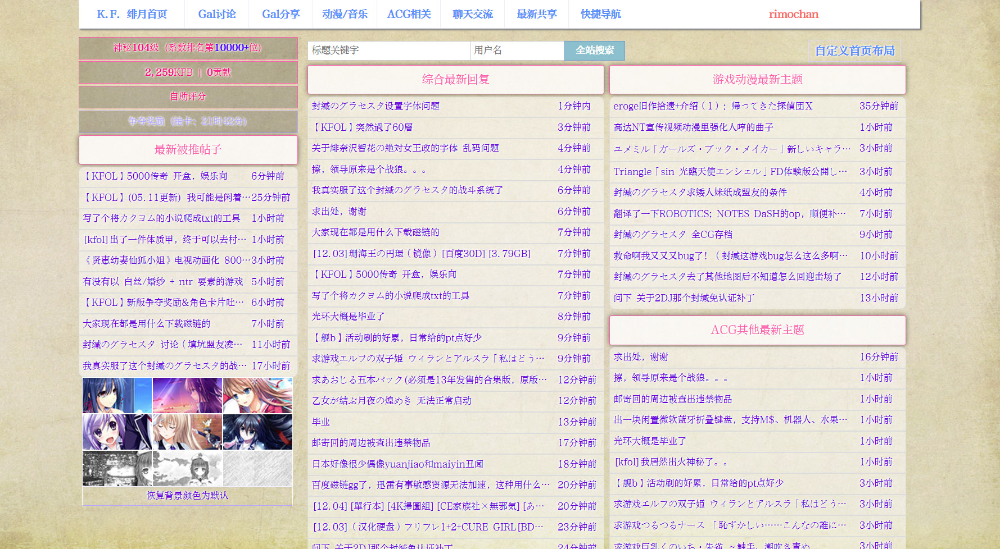
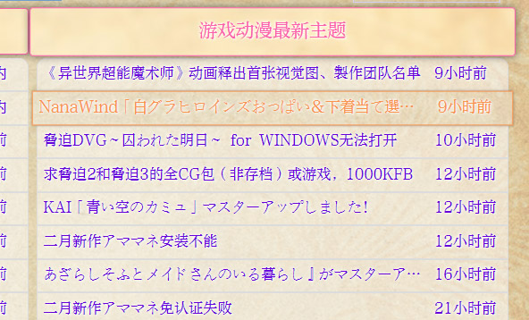
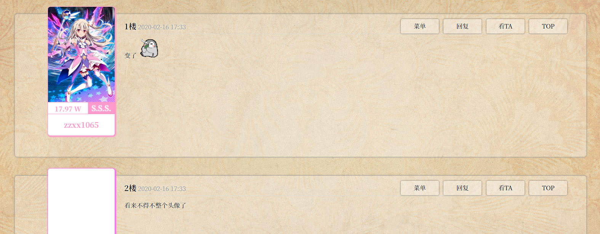
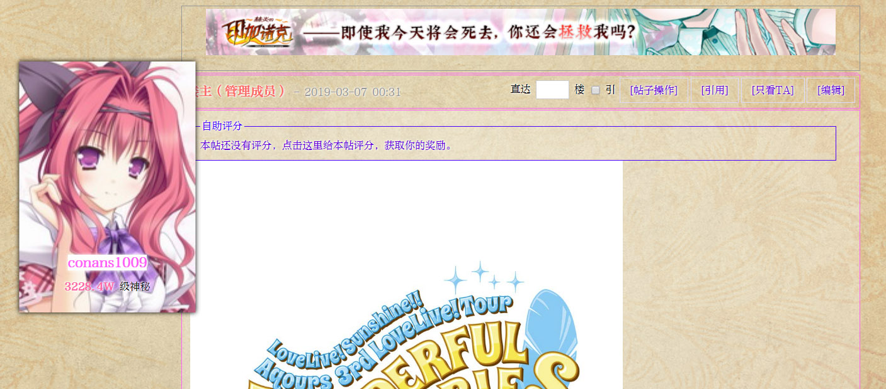

# 我在緋月論壇用的CSS

## 簡介
我在緋月論壇用的CSS。

直接將manta_style.css的內容使用KF助手導入就好了。
(當然如果你有Stylish就更好了。)

## 預覽
首頁:   

鼠標懸停於鏈接:   

帖子:    

鼠標懸停於頭像:     

## 注意

css並不包含字體，預覽圖的字體「方正雅宋」是要錢的所以不能放。我自己設這個爲瀏覽器的默認字體了。

因爲頭像限制30k所以很多人的頭像都很小，放大了以後就會模糊……